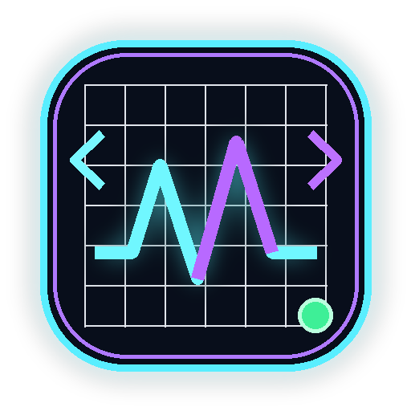
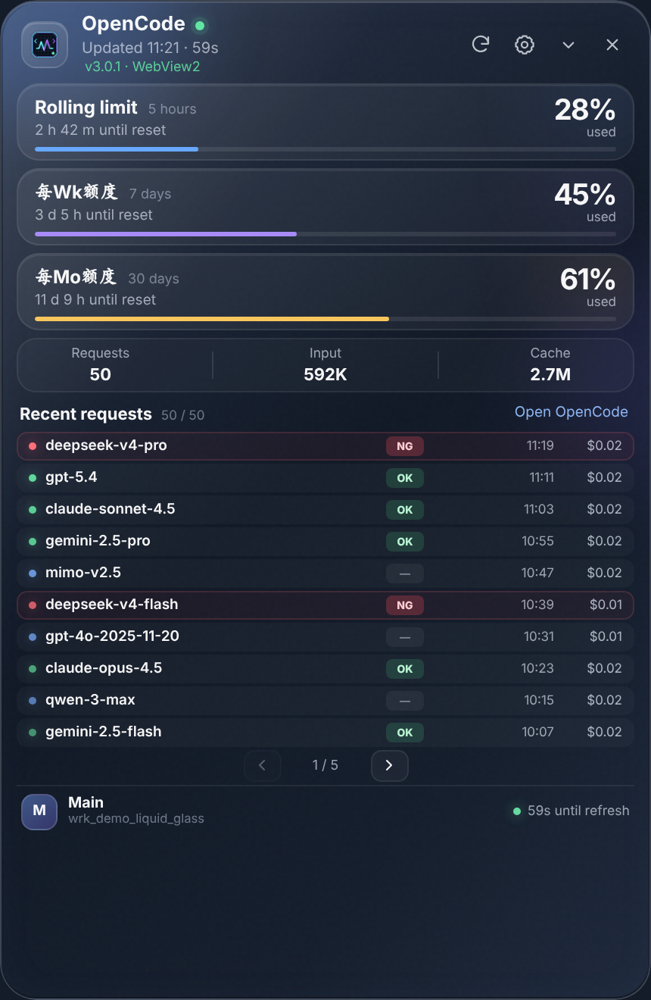
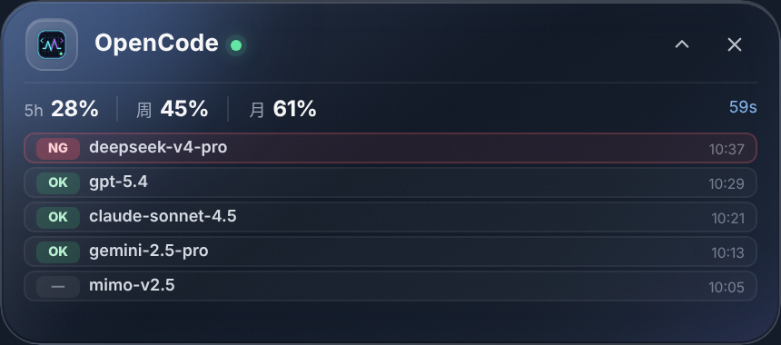

# OpenCode Desktop Widget · WebView2 版

<p align="center">
  
</p>

<p align="center">
  轻量级 Windows 桌面挂件，用于查看 OpenCode 用量、最近调用记录与模型状态。<br>
  A lightweight Windows desktop widget for monitoring OpenCode usage, recent requests, and model status.
</p>

<p align="center">
  
  
  
  
</p>

## 预览 / Preview

> 以下英文截图来自当前仓库中的真实界面（`src/renderer`）渲染结果，使用内置演示数据展示，不是重画示意图。  
> The screenshots below are rendered from the actual UI in this repository (`src/renderer`) with the built-in demo data.

### 展开模式 / Expanded



### 收起模式 / Compact



## 功能特性 / Features

- **三段额度概览**：显示滚动额度、每周额度、每月额度，以及重置倒计时。  
  Rolling / weekly / monthly usage with reset countdown.
- **最近调用记录**：展示最近 50 条调用记录，支持分页查看。  
  Recent request list with up to 50 records and pagination.
- **模型状态标记**：按规则区分 `OK / NG / —`，方便快速识别模型使用情况。  
  Model status rules for `OK / NG / —` labels.
- **紧凑模式**：可收起为更小挂件，仅保留关键信息。  
  Compact mode for a smaller always-visible widget.
- **桌面增强能力**：支持置顶、贴边隐藏、托盘驻留等桌面行为。  
  Desktop behaviors such as always-on-top, edge-hide, and tray integration.
- **网页登录**：通过 WebView2 登录 OpenCode，并读取登录 Cookie。  
  Web login flow through WebView2 with cookie capture.
- **提醒与规则**：支持剩余额度阈值提醒、OK/NG 模型规则、NG 警报。  
  Usage warnings, OK/NG rule configuration, and NG alerts.

## 项目说明 / About

这个版本将原先的 Electron/Chromium 宿主替换为 **C# WinForms + Microsoft Edge WebView2**。  
界面仍然使用原本的 **HTML / CSS / JavaScript**，但不再随程序打包一整套 Chromium。

This version replaces the previous Electron/Chromium host with **C# WinForms + Microsoft Edge WebView2**, while keeping the existing **HTML / CSS / JavaScript** UI.

## 技术栈 / Tech Stack

- **Host**: C# / WinForms / .NET 8
- **Embedded browser**: Microsoft Edge WebView2
- **UI**: HTML + CSS + JavaScript
- **Data scripts**: `scripts/metrics.js`, `scripts/records.js`
- **Configuration**: `%APPDATA%\OpenCode Desktop Widget\config.json`

## 开发与编译 / Build

### 环境要求

1. Windows 10 / 11  
2. Visual Studio 2022 或 .NET 8 SDK  
3. Microsoft Edge WebView2 Runtime

项目固定使用：

```text
Microsoft.Web.WebView2 1.0.4078.44
```

### 编译

构建依赖 .NET 8 Desktop Runtime 的较小版本：

```bat
build.bat
```

输出目录：

```text
publish\win-x64\
```

如需无需额外安装 .NET Runtime 的版本：

```bat
build-self-contained.bat
```

### 运行

```text
publish\win-x64\OpenCode.Desktop.Widget.exe
```

首次使用点击 **“网页登录”**，完成 OpenCode 登录后会自动捕获工作区与登录 Cookie。

## 配置兼容 / Config Compatibility

配置文件路径：

```text
%APPDATA%\OpenCode Desktop Widget\config.json
```

- 旧 Electron 版的 `plain:` 凭据可以直接读取。
- `enc:` 凭据会尝试通过 Windows DPAPI 解密。
- 如果旧版加密格式不兼容，程序会提示重新登录。

## v3.0.1 修复 / Fixes

- 修复 Windows 125% / 150% / 175% 缩放下 WebView2 内容被放大裁切。
- 修复完整模式底部分页和账户栏不可见。
- 修复标题栏刷新秒数被按钮遮挡。
- 修复紧凑模式高度不正确、模型行消失。
- 修复 CSS 圆角与原生窗口圆角不一致造成的黑边。

## 目录结构 / Project Structure

```text
assets/           图标等资源
scripts/          页面抓取脚本
src/host/         WinForms 宿主逻辑
src/renderer/     挂件前端界面（HTML/CSS/JS）
publish/win-x64/  发布输出
```

## License

请根据你的实际授权方式补充许可证内容。  
Add your actual license information here if you plan to publish the repository publicly.
