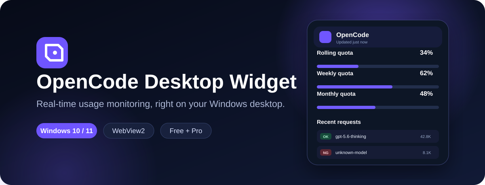
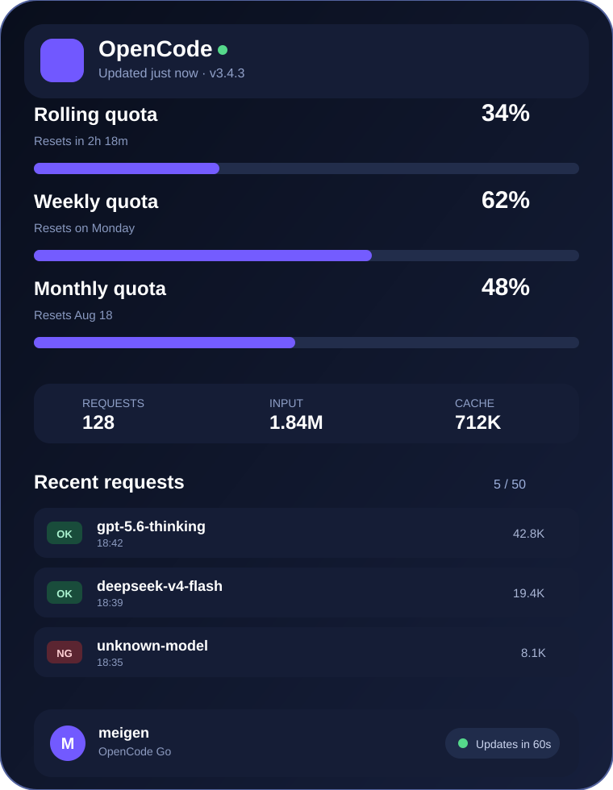
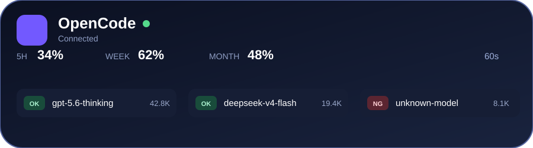

<p align="center">
  
</p>

<p align="center">
  <a href="../../releases"></a>
  
  
  
</p>

<p align="center">
  <b>A lightweight Windows desktop widget for monitoring OpenCode usage in real time.</b><br>
  Rolling, weekly, and monthly quotas · Recent requests · Model OK/NG alerts · English and Chinese
</p>

<p align="center">
  <a href="#download">Download</a> ·
  <a href="#features">Features</a> ·
  <a href="#quick-start">Quick Start</a> ·
  <a href="#build-from-source">Build</a> ·
  <a href="#中文说明">中文说明</a>
</p>

---

## Preview

<p align="center">
  
</p>

<p align="center"><b>Expanded Pro interface</b> — quotas, request history, token totals, model status, and account controls in one view.</p>

<p align="center">
  
</p>

<p align="center"><b>Compact Free interface</b> — a small always-available overview that stays out of your way.</p>

## Features

- **Live quota monitoring** — rolling, weekly, and monthly usage with reset times.
- **Recent request history** — view the latest 50 calls and token totals.
- **Model OK / NG rules** — wildcard matching, desktop notifications, and window flashing.
- **Desktop-friendly behavior** — always on top, click-through, edge auto-hide, and tray controls.
- **Fast and lightweight** — C# WinForms + Microsoft Edge WebView2, without bundling Chromium.
- **Bilingual UI** — switch between English and Simplified Chinese.
- **Multiple accounts** — save and switch between OpenCode accounts.
- **CSV export** — export usage records for your own analysis.
- **Secure local storage** — sign-in credentials are encrypted with Windows DPAPI.

## Free and Pro

| Feature | Free | Pro |
|---|:---:|:---:|
| Compact quota overview | ✓ | ✓ |
| Model OK / NG status | ✓ | ✓ |
| Full expanded interface | — | ✓ |
| Recent request history | — | ✓ |
| Detailed token statistics | — | ✓ |
| One-time purchase | — | **US$2** |

## Download

1. Open the [Releases](../../releases) page.
2. Download the newest `OpenCode-Desktop-Widget-Protected-client.zip`.
3. Extract the ZIP and run `OpenCode.Desktop.Widget.exe`.

No installer is required.

### Requirements

- Windows 10 or Windows 11
- Microsoft Edge WebView2 Runtime
- Internet access for OpenCode sign-in and usage synchronization

> WebView2 is included with Windows 11 and is normally installed with Microsoft Edge on Windows 10.

## Quick Start

1. Launch the widget. It starts in compact Free mode.
2. Select **Web sign-in** and complete your OpenCode login.
3. Your workspace, quota data, and recent requests are detected automatically.
4. Use the tray menu to show, hide, refresh, expand, collapse, open settings, or exit.
5. Select the lock icon to purchase Pro or enter a license key.

## License behavior

- One license supports up to **2 devices** by default.
- Pro sessions renew automatically every **7 days**.
- A **14-day offline grace period** keeps Pro available without a network connection.
- Refunded, revoked, or unbound licenses return the widget to compact Free mode.
- Legacy license keys remain supported and migrate automatically.

## Build from Source

### Requirements

- Windows 10/11
- .NET 8 SDK or Visual Studio 2022
- Microsoft Edge WebView2 Runtime

Run one of the included scripts:

```bat
build.bat
```

Framework-dependent build. Output:

```text
publish\win-x64\
```

Or create a self-contained build:

```bat
build-self-contained.bat
```

The project pins `Microsoft.Web.WebView2` to version `1.0.4078.44`.

## Configuration

`store.json`, located next to the executable, controls the product name, license server, purchase link, and support email:

```json
{
  "productName": "OpenCode Desktop Widget Pro",
  "licenseServerUrl": "https://your-license-server.example.com",
  "purchaseUrl": "https://buy.stripe.com/your-payment-link",
  "supportEmail": "support@example.com"
}
```

User settings are stored at:

```text
%APPDATA%\OpenCode Desktop Widget\config.json
```

## Security and privacy

- OpenCode credentials are encrypted locally with Windows DPAPI.
- The application does not bundle a separate Chromium browser.
- Usage data is displayed locally by the desktop client.
- Review the source code and build it yourself when stronger verification is required.

## 中文说明

OpenCode Desktop Widget 是一款 Windows 桌面挂件，可实时查看 OpenCode 的滚动、每周和每月额度，并显示最近调用记录、Token 统计以及模型 OK/NG 状态。

### 主要功能

- 免费版提供紧凑收起界面。
- Pro 版一次性购买 **2 美元**，解锁完整展开界面。
- 支持模型规则、桌面通知、窗口闪烁和通配符匹配。
- 支持贴边隐藏、始终置顶、鼠标穿透、托盘菜单和自动刷新。
- 支持中英文切换、多账户管理和 CSV 导出。
- 登录凭据使用 Windows DPAPI 加密保存。

### 安装方法

前往 [Releases](../../releases) 下载最新客户端压缩包，解压后运行：

```text
OpenCode.Desktop.Widget.exe
```

首次启动后点击网页登录，完成 OpenCode 登录即可自动读取工作区和额度信息。

## Changelog

- **v3.4.3** — revocable server licenses, 2-device limit, 7-day renewal, 14-day offline grace period, minimum-version control.
- **v3.3.0** — automatic Stripe license delivery after payment.
- **v3.2.0** — English and Chinese interface.
- **v3.1.0** — Free compact mode and paid expanded Pro mode.
- **v3.0.x** — WebView2 rewrite and Windows scaling fixes.

## Disclaimer

This project is provided as-is without warranty. OpenCode names and services belong to their respective owners. Use of OpenCode data is subject to OpenCode's terms of service.
